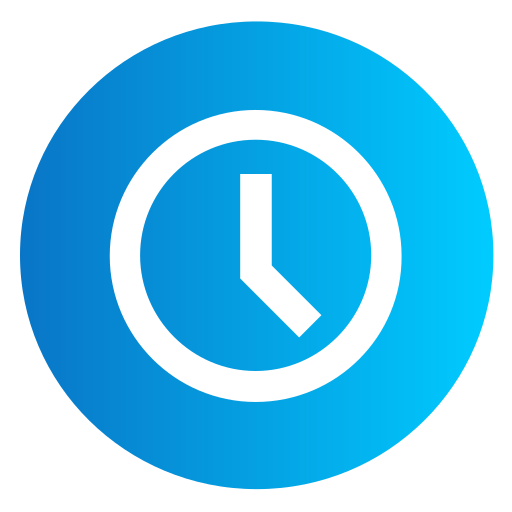

# RKTimeTrack 
## Description
A time tracking tool based on Vue.js / ASP.NET Core. It is meant for my personal use as
a freelance software architect and for some technology focused demos.

## Screenshot

## Project is based on ...
RKTimeTrack is based on ASP.NET Core and Vue.js.
Furthermore, the project is based on following technologies / projects:
 - [Bootstrap](https://getbootstrap.com/): Powerful, extensible, and feature-packed frontend toolkit
 - [FluentAssertions](https://github.com/fluentassertions/fluentassertions): A very extensive set of extension methods that allow you to more naturally specify the expected outcome of a TDD or BDD-style unit tests
 - [FluentValidation](https://github.com/FluentValidation/FluentValidation): A popular .NET validation library for building strongly-typed validation rules
 - [Light.GuardClauses](https://github.com/feO2x/Light.GuardClauses): A lightweight .NET library for expressive Guard Clauses.
 - [Microsoft.Playwright](https://playwright.dev/): Playwright enables reliable end-to-end testing for modern web apps
 - [NSubstitube](https://github.com/nsubstitute/NSubstitute): A friendly substitute for .NET mocking libraries
 - [NSwag](https://github.com/RicoSuter/NSwag): The Swagger/OpenAPI toolchain for .NET, ASP.NET Core and TypeScript
 - [OneOf](https://github.com/mcintyre321/OneOf/): Easy to use F#-like ~discriminated~ unions for C# with exhaustive compile time matching
 - [Pinia](https://pinia.vuejs.org/): The intuitive store for Vue.js
 - [PrimeVue](https://primevue.org/): Vue UI Component Library
 - [Serilog](https://serilog.net/): Simple .NET logging with fully-structured events
 - [Swashbuckle.AspNetCore](https://github.com/domaindrivendev/Swashbuckle.AspNetCore): Swagger tools for documenting API's built on ASP.NET Core
 - [Testcontainer](https://testcontainers.com/): Testcontainers is an open source library for providing throwaway, lightweight instances of databases, message brokers, web browsers, or just about anything that can run in a Docker container
 - [UUID Generator](https://www.uuidgenerator.net/): Library for generating UUIDs in TypeScript
 - [Vuelidate](https://vuelidate-next.netlify.app/): A simple, but powerful, lightweight model-based validation for Vue.js 3 and 2
 - [VueUse](https://vueuse.org/): Collection of Vue Composition Utilities
 - [xunit](https://github.com/xunit/xunit): xUnit.net is a free, open source, community-focused unit testing tool for .NET
 - ... and many more